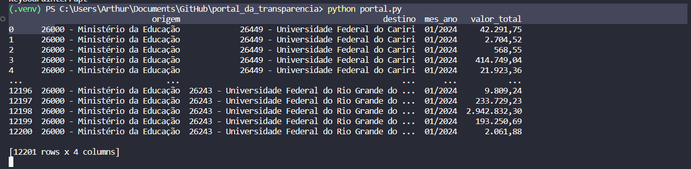

<h1 align="center"> Fazendo consulta de despesas públicas com o Playwright </h1>

<h2 align="left"> Objetivos </h2>

 <li>Esse projeto tem a intenção de apresentar a utilização da biblioteca Playwright de forma simples.
 <li>O script faz a extração de despesas públicas diretamente do site do <a href="https://portaldatransparencia.gov.br/">Portal da Transparência</a> por classificação contábil de forma automatizada, gerando um dataframe e um arquivo .csv com os dados das despesas.
 <li>Projeto utilizado para a apresentação-resumo do artigo no evento SELITEC Internacional.

<h2 align="left"> Tecnologias Utilizadas </h2>

 
 <li>Python 3.10.0
 <li>Playwright (Async) 1.28
 <li>BeautifulSoup4 4.11.1
 <li>As libs restantes se encontram no arquivo de texto requirements.txt, e pode ser instalado através do comando "pip install -r requirements.txt"

<h2 align="left"> Exemplo de Saída </h2>

